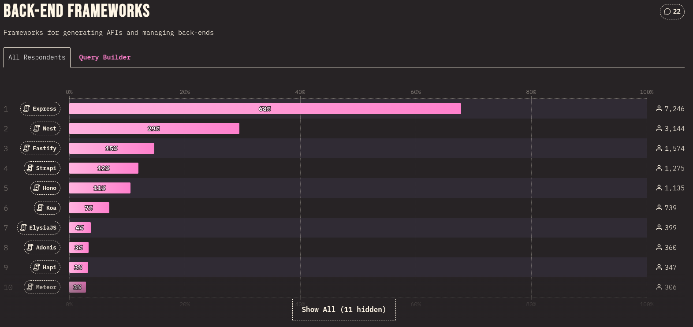

# Backend

En cada microservicio se utiliza el framework [NestJS](https://nestjs.com/) para cubrir las necesidades backend de la aplicación, se elige este proyecto como alternativa al framework [ExpressJS](https://expressjs.com/), que ya es muy conocido y utilizado. En los listados `Best NodeJS Frameworks` aparece _NestJS_ como uno de los mejores, por ese motivo se consideró su uso. Además, en el proyecto se utiliza TypeScript como lenguaje de programación predeterminado.

Otro factor que se consideró para utiliar NestJS fue su popularidad en el mercado durante el 2024.



Fuente: [https://stateofjs.com/en-US](https://2024.stateofjs.com/en-US/other-tools/)

## TABLA DE CONTENIDO

- [Backend](#backend)
  - [TABLA DE CONTENIDO](#tabla-de-contenido)
  - [📌 Nuevo microservicio con NestJS](#-nuevo-microservicio-con-nestjs)
  - [📌 Modificación del proyecto](#-modificación-del-proyecto)
    - [🔶 Remover la carpeta `.git`](#-remover-la-carpeta-git)
    - [🔶 ConfigModule - environments](#-configmodule---environments)
      - [Puerto del servicio](#puerto-del-servicio)
      - [Archivo `.env`](#archivo-env)
      - [Instalación paquete `@nestjs/config`](#instalación-paquete-nestjsconfig)
      - [Importar ConfigModule](#importar-configmodule)
      - [Archivo de configuración personalizado](#archivo-de-configuración-personalizado)
      - [Archivo `configurations.ts`](#archivo-configurationsts)
  - [📌 Estructura](#-estructura)
    - [🔶 CRUD](#-crud)
    - [🔶 DTO](#-dto)
    - [🔶 Módulos](#-módulos)
    - [🔶 Servicios](#-servicios)
    - [🔶 Controladores](#-controladores)
    - [🔶 CRUD](#-crud-1)
    - [🔶](#)
  - [📌 Base de datos](#-base-de-datos)
    - [🔶 TypeORM Integration](#-typeorm-integration)
    - [🔶 Importar TypeOrmModule](#-importar-typeormmodule)
  - [📌 Swagger](#-swagger)
    - [🔶 Instalación paquete `@nestjs/swagger`](#-instalación-paquete-nestjsswagger)
    - [🔶 Importar SwaggerModule](#-importar-swaggermodule)
    - [🔶 Modificación a DTOs](#-modificación-a-dtos)
  - [📌 Variables de entorno](#-variables-de-entorno)
- [JWT](#jwt)
- [Referencias](#referencias)

## 📌 Nuevo microservicio con NestJS

Se seguiran las recomendaciones de la [documentación oficial](https://docs.nestjs.com/) para crear cada microservicio. La documentación recomienda a los usuarios nuevos utilizar **Nest CLI** para crear los proyectos.

Instalar el paquete **Nest CLI** de manera global

```shell
sudo npm i -g @nestjs/cli
```

Colocarse en la carpeta que alojará el nuevo proyecto y ejecutar el siguiente comando para crearlo:

```shell
nest new --skip-git --package-manager npm [nombre-del-microservicio]
```

donde:

- **--skip-git**: indica que no se creará un repositorio GIT al crear el proyecto.
- **--package-manager**: indica el administrador de paquetes a utilizar, en este caso **npm**.
- **[nombre-del-microservicio]**: nombre del microservicio a crear.

Para ejecutar el proyecto se utiliza el comando:

```shell
npm run start:dev
```

## 📌 Modificación del proyecto

### 🔶 Remover la carpeta `.git`

En caso de no enviar `--skip-git` como argumento en la creación del proyecto, la primera modificación que se le hará es eliminar la carpeta `.git`. Cuando se creó el proyecto desde **Nest CLI** se hizo un _git init_ de manera interna, eso quiere decir que se creó un nuevo repositorio GIT. Es importante eliminar esta carpeta porque al momento de hacer un commit en el proyecto principal, el proyecto de Nest es reconocido como un módulo y no como parte de la fuente principal.

Ingresar a la carpeta del proyecto `[nombre-del-microservicio]`

```shell
cd [nombre-del-microservicio]
```

Eliminar la carpeta `.git`

```shell
sudo rm -r .git
```

### 🔶 ConfigModule - environments

Se utilizará el paquete `@nestjs/config` para utilizar variables de entorno, este paquete utiliza `dotenv` de forma interna. Se utilizarán variables de entorno para almacenar valores sensibles y variables del proyecto, también para poder configurar los distintos ambientes y desplegar.

#### Puerto del servicio

El primer valor que estará en las variables de entorno será el puerto de servicio, **de forma predeterminada tiene el puerto 3000**. Crearemos un archivo con el nombre `.env` que contendrá todas las variables.

#### Archivo `.env`

Creamos el archivo y en la misma instrucción ingresamos el contenido

```shell
echo "APP_PORT=3000" > .env
```

#### Instalación paquete `@nestjs/config`

Seguiremos los pasos de la [documentación oficial](https://docs.nestjs.com/techniques/configuration), ejecutamos el siguiente comando:

```shell
npm i --save @nestjs/config
```

#### Importar ConfigModule

La importación se hará en el `appModule` raíz, [src/app.module.ts](src/app.module.ts), y se definirá cómo funcionará en el módulo principal con el método estático `.forRoot()`.

```ts added=4,8
import { Module } from "@nestjs/common";
import { AppController } from "./app.controller";
import { AppService } from "./app.service";
import { ConfigModule } from "@nestjs/config";

@Module({
  imports: [ConfigModule.forRoot()],
  controllers: [AppController],
  providers: [AppService],
})
export class AppModule {}
```

#### [Archivo de configuración personalizado](https://docs.nestjs.com/techniques/configuration#custom-configuration-files)

Si las variables de entorno se utilizan de forma regada, no podremos tener visible **_todas_** las variables de entorno que tiene el proyecto, esto porque el archivo `.env` no se encuentra en el repositorio. Lo que haremos es crear un archivo _intermedio_ que importará todas las variables de entorno y desde ahí si se podrán exportar al código fuente, éste archivo servirá como referencia para generar nuestro propio `.env` de forma local.

#### Archivo `configurations.ts`

El archivo `configurations.ts` contendrá todas las variables de entorno que se utilizarán en el proyecto, además de definir los tipos de datos que tendrá cada variable. En este archivo se pueden definir valores por defecto para cada variable, en caso de no encontrarse en el archivo `.env`.

Crear la carpeta de configuración

```shell
mkdir -p src/config
```

Creamos el archivo `configurations.ts` en la carpeta _config_

```shell
touch src/config/configurations.ts
```

El contenido inicial del archivo será:

```ts
export default () => ({
  appPort: parseInt(process.env.APP_PORT!, 10) || 3000,
});
```

Volveremos a modificar el archivo del módulo principal, [src/app.module.ts](src/app.module.ts), ahora indicaremos que se utilizará un archivo de configuración personalizado. El contenido del módulo quedará de la siguiente forma:

```ts added=5,10
import { Module } from "@nestjs/common";
import { AppController } from "./app.controller";
import { AppService } from "./app.service";
import { ConfigModule } from "@nestjs/config";
import configurations from "./config/configurations";

@Module({
  imports: [
    ConfigModule.forRoot({
      load: [configurations],
    }),
  ],
  controllers: [AppController],
  providers: [AppService],
})
export class AppModule {}
```

El archivo `main.ts` es el punto de entrada del proyecto, es donde se inicializa el módulo principal y se inicia el servidor.
El contenido del archivo `main.ts` será el siguiente:

```ts
import { NestFactory } from "@nestjs/core";
import { AppModule } from "./app.module";
import configurations from "./config/configurations";

async function bootstrap() {
  const app = await NestFactory.create(AppModule);
  await app.listen(configurations().appPort);
}
bootstrap();
```

## 📌 Estructura

### 🔶 CRUD

```shell
nest generate resource temporal
? What transport layer do you use? REST API
? Would you like to generate CRUD entry points? Yes
CREATE temporal/temporal.controller.spec.ts (596 bytes)
CREATE temporal/temporal.controller.ts (967 bytes)
CREATE temporal/temporal.module.ts (269 bytes)
CREATE temporal/temporal.service.spec.ts (474 bytes)
CREATE temporal/temporal.service.ts (663 bytes)
CREATE temporal/dto/create-temporal.dto.ts (34 bytes)
CREATE temporal/dto/update-temporal.dto.ts (185 bytes)
CREATE temporal/entities/temporal.entity.ts (25 bytes)
UPDATE app.module.ts (790 bytes
```

### 🔶 DTO

https://docs.nestjs.com/openapi/mapped-types

```shell
npm install class-validator
```

### 🔶 Módulos

```shell
nest generate module temporal
```

### 🔶 Servicios

```shell
nest generate service temporal
```

### 🔶 Controladores

```shell
nest generate controller temporal
```

### 🔶 CRUD

https://blog.devgenius.io/setting-up-nestjs-with-postgresql-ac2cce9045fe

### 🔶

https://dev.to/smolinari/nestjs-and-project-structure-what-to-do-1223

## 📌 Base de datos

Para este proyecto se decidió utilizar **PostgreSQL**, los detalles de la base de datos se encuentran en [postgresql.md](postgresql.md).

### 🔶 TypeORM Integration

Se utilizará el paquete `@nestjs/typeorm` ya que se encuentra dentro de los recursos provistos por NestJS, además, éste es un ORM maduro escrito en TypeScript.

```shell
npm install --save @nestjs/typeorm typeorm pg
```

### 🔶 Importar TypeOrmModule

Al igual que `ConfigModule`, al finalizar la instalación se debe de importar el paquete `TypeOrmModule` al módulo principal, [src/app.module.ts](src/app.module.ts). Se hace un **import** y luego se agrega a **array imports**:

```ts

```

## 📌 Swagger

Se utilizará la especificación **OpenAPI** para describir los APIs RESTful disponibles, para eso se utilizará el módulo `@nestjs/swagger`.

### 🔶 Instalación paquete `@nestjs/swagger`

Dentro de la carpeta del proyecto ejecutar:

```shell
npm install --save @nestjs/swagger
```

### 🔶 Importar SwaggerModule

Al finalizar la instalación del paquete, importar el módulo `SwaggerModule` en el archivo [src/main.ts](src/main.ts). La importación será similar a la siguiente:

```ts added=4,9-17
import { NestFactory } from "@nestjs/core";
import { AppModule } from "./app.module";
import configurations from "./config/configurations";
import { SwaggerModule, DocumentBuilder } from "@nestjs/swagger";

async function bootstrap() {
  const app = await NestFactory.create(AppModule);

  const config = new DocumentBuilder()
    .setTitle("Service")
    .setDescription("The service API description")
    .setVersion("1.0")
    .addTag("TAG")
    .build();

  const document = SwaggerModule.createDocument(app, config);
  SwaggerModule.setup("api", app, document);

  await app.listen(configurations().appPort);
}
bootstrap();

//.env values
console.log("CONFIGURATIONS");
console.log(configurations());
```

Notar que se ingresó la información que se visualizará en la página de Swagger. Title, Description, Version y Tag.

### 🔶 Modificación a DTOs

Para Swagger, los DTOs definen los campos y tipo de dato que puede ingresar en cada EndPoint. Tener definida cada propiedad de la clase permitirá que esa información sea visible desde Swagger. A cada DTO se le agrega la propiedad `@ApiProperty()` sobre la declaración de la propiedad. Ejemplo de un DTO

```ts
import { ApiProperty } from "@nestjs/swagger";

export class CreateTemporalDto {
  @ApiProperty()
  id: number;

  @ApiProperty()
  text: string;

  @ApiProperty()
  flag: boolean;
}
```

## 📌 Variables de entorno

Todas las variables de entorno y los valores sensibles se encuentran en el archivo `.env`. El archivo se encuentra en la raíz del proyecto.

```shell
$ nest generate resource auth
✔ What transport layer do you use? REST API
✔ Would you like to generate CRUD entry points? Yes
CREATE src/auth/auth.controller.spec.ts (556 bytes)
CREATE src/auth/auth.controller.ts (883 bytes)
CREATE src/auth/auth.module.ts (241 bytes)
CREATE src/auth/auth.service.spec.ts (446 bytes)
CREATE src/auth/auth.service.ts (607 bytes)
CREATE src/auth/dto/create-auth.dto.ts (30 bytes)
CREATE src/auth/dto/update-auth.dto.ts (164 bytes)
CREATE src/auth/entities/auth.entity.ts (21 bytes)
UPDATE src/app.module.ts (1275 bytes)
```

# JWT

```shell
npm i @nestjs/jwt @nestjs/passport passport passport-jwt bcryptjs
npm i -D @types/passport-jwt @types/bcryptjs
```

# Referencias

https://docs.nestjs.com/techniques/database#async-configuration
