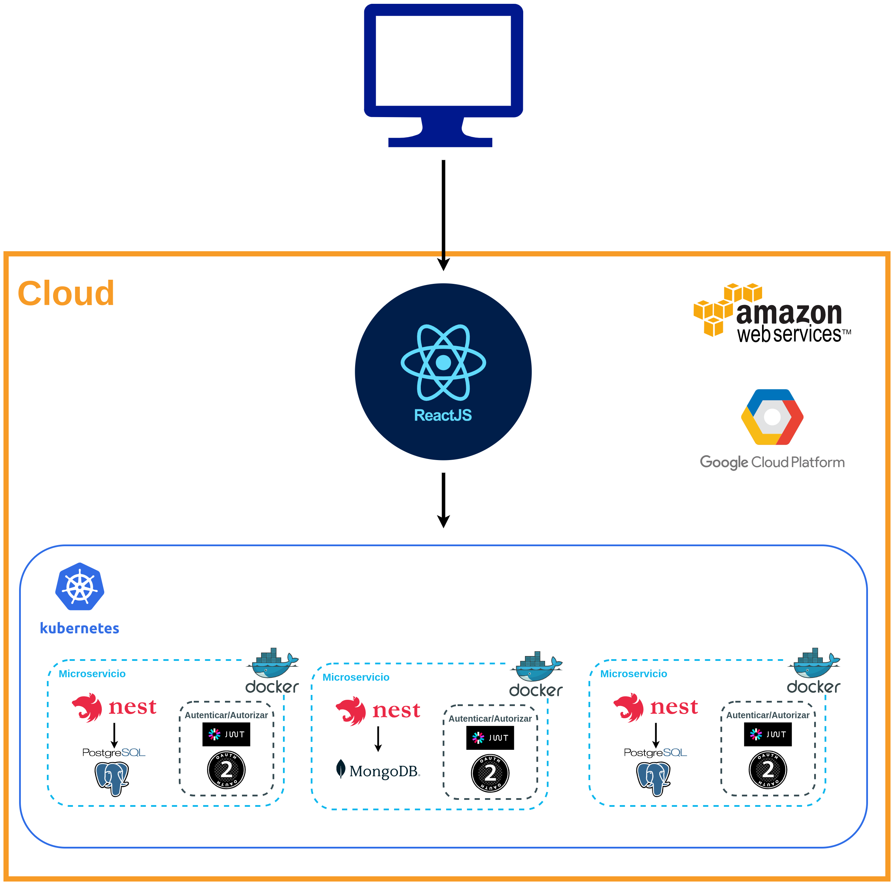
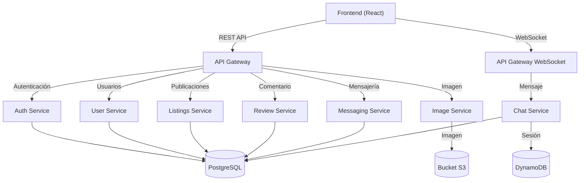

# Arquitectura

> La arquitectura de microservicios es un enfoque para el desarrollo de software que consiste en construir una aplicación como un conjunto de pequeños servicios, los cuales se ejecutan en su propio proceso y se comunican con mecanismos ligeros. - [Wikipedia](https://es.wikipedia.org/wiki/Arquitectura_de_microservicios)

Se implementa una arquitectura basada en **microservicios** para garantizar **escalabilidad**, **seguridad** y **desempeño óptimo** del sistema. Con la **separación de responsabilidades** a través de estos componentes se mejora la mantenibilidad y se facilita la evolución del sistema.

## 📌 **Información general sobre los microservicios**

Cada microservicio estará **contenedorizado** con **Docker** y orquestado con **Kubernetes**, lo que permitirá:

- **Escalabilidad horizontal**, ya que los servicios se pueden replicar según la demanda.
- **Resiliencia**, evitando que una falla en un servicio afecte todo el sistema.
- **Autonomía**, permitiendo actualizaciones independientes de cada componente.

🔷 **Tecnologías base:**

- **NestJS (TypeScript)** → Para los microservicios.
- **RabbitMQ** → Para la comunicación asíncrona entre microservicios.
- **API Gateway (Express o Kong)** → Para centralizar las solicitudes de frontend.
- **PostgreSQL & MongoDB** → Bases de datos relacional y NoSQL.
- **Redis** → Para caché y optimización de consultas.

### 🔶 Diagrama general

---

## 📌 **Microservicios y sus responsabilidades**

La arquitectura se divide en los siguientes **microservicios independientes**, cada uno con su propia base de datos.

| Microservicio                        | Descripción                                                     | Base de Datos |
| ------------------------------------ | --------------------------------------------------------------- | ------------- |
| **Auth Service**                     | Maneja autenticación, JWT, OAuth, y permisos.                   | PostgreSQL    |
| **User Service**                     | Maneja perfiles de usuario, roles y reputación.                 | PostgreSQL    |
| **Listings Service**                 | Gestión de publicaciones de compra, venta, alquiler y donación. | MongoDB       |
| **_Transaction Service(pendiente)_** | Maneja pagos y registros de transacciones.                      | PostgreSQL    |
| **Messaging Service**                | Chat entre usuarios para coordinar intercambios.                | MongoDB       |
| **Review Service**                   | Valoraciones y comentarios de usuarios y productos.             | PostgreSQL    |
| **Admin Service**                    | Panel de administración para moderación.                        | PostgreSQL    |

Cada uno de estos servicios se comunica a través de **APIs REST** y eventos asincrónicos en **RabbitMQ**.

### 🔶 **API Contracts (Contratos de cada Microservicio)**

Los contratos API (API Contracts) son acuerdos formales que describen cómo se deben comunicar los servicios que interactúan mediante una API. Con los siguientes contratos se podrá integrar el software de manera correcta manteniendo un intercambio de datos ordenado:

---

#### 📝 **Auth Service (Autenticación y Seguridad)**

> **Base de Datos**: PostgreSQL  
> **Responsabilidad**: Registro, autenticación y autorización de usuarios.

✅ **Endpoints**

| Método | Endpoint         | Descripción                                  |
| ------ | ---------------- | -------------------------------------------- |
| `POST` | `/auth/register` | Registro de usuario con email y password.    |
| `POST` | `/auth/login`    | Iniciar sesión con JWT.                      |
| `POST` | `/auth/logout`   | Cerrar sesión.                               |
| `GET`  | `/auth/me`       | Obtener información del usuario autenticado. |

---

#### 📝 **User Service (Gestión de Usuarios)**

> **Base de Datos**: PostgreSQL  
> **Responsabilidad**: Información de usuario, roles y reputación.

✅ **Endpoints**

| Método  | Endpoint                | Descripción                              |
| ------- | ----------------------- | ---------------------------------------- |
| `GET`   | `/users/:id`            | Obtener información de usuario.          |
| `PATCH` | `/users/:id`            | Actualizar perfil de usuario.            |
| `GET`   | `/users/:id/reputation` | Obtener la reputación basada en reviews. |

---

#### 📝 **Listings Service (Gestión de Publicaciones)**

> **Base de Datos**: MongoDB  
> **Responsabilidad**: Creación y gestión de publicaciones.

✅ **Endpoints**

| Método   | Endpoint        | Descripción                              |
| -------- | --------------- | ---------------------------------------- |
| `POST`   | `/listings`     | Crear una nueva publicación.             |
| `GET`    | `/listings`     | Obtener todas las publicaciones activas. |
| `GET`    | `/listings/:id` | Obtener detalles de una publicación.     |
| `PATCH`  | `/listings/:id` | Editar una publicación existente.        |
| `DELETE` | `/listings/:id` | Eliminar una publicación.                |

---

#### 📝 **Transaction Service (pendiente) (Gestión de Transacciones)**

> **Base de Datos**: PostgreSQL  
> **Responsabilidad**: Maneja las transacciones de compra, alquiler e intercambio de recursos académicos.

✅ **Endpoints**

| Método  | Endpoint                     | Descripción                                          |
| ------- | ---------------------------- | ---------------------------------------------------- |
| `POST`  | `/transactions`              | Crear una nueva transacción.                         |
| `GET`   | `/transactions/:id`          | Obtener detalles de una transacción específica.      |
| `GET`   | `/transactions/user/:userId` | Obtener el historial de transacciones de un usuario. |
| `PATCH` | `/transactions/:id/cancel`   | Cancelar una transacción.                            |
| `PATCH` | `/transactions/:id/complete` | Marcar una transacción como completada.              |

---

#### 📝 **Messaging Service (Chat en Tiempo Real)**

> **Base de Datos**: MongoDB  
> **Responsabilidad**: Permite la comunicación entre usuarios para coordinar intercambios.

✅ **Endpoints**

| Método | Endpoint                               | Descripción                                          |
| ------ | -------------------------------------- | ---------------------------------------------------- |
| `POST` | `/messages`                            | Enviar un nuevo mensaje.                             |
| `GET`  | `/messages/conversation/:user1/:user2` | Obtener el historial de mensajes entre dos usuarios. |
| `GET`  | `/messages/user/:userId`               | Obtener todas las conversaciones de un usuario.      |

---

#### 📝 **Review Service (Valoraciones y Comentarios)**

> **Base de Datos**: PostgreSQL  
> **Responsabilidad**: Gestiona puntuaciones y comentarios sobre usuarios y productos.

✅ **Endpoints**

| Método   | Endpoint                      | Descripción                                    |
| -------- | ----------------------------- | ---------------------------------------------- |
| `POST`   | `/reviews`                    | Agregar una nueva valoración.                  |
| `GET`    | `/reviews/user/:userId`       | Obtener todas las valoraciones de un usuario.  |
| `GET`    | `/reviews/listing/:listingId` | Obtener todas las valoraciones de un producto. |
| `DELETE` | `/reviews/:id`                | Eliminar una valoración.                       |

---

#### 📝 **Admin Service (Panel de Administración y Moderación)**

> **Base de Datos**: PostgreSQL  
> **Responsabilidad**: Permite a los administradores gestionar usuarios, publicaciones y reportes.

✅ **Endpoints**

| Método  | Endpoint                     | Descripción                                |
| ------- | ---------------------------- | ------------------------------------------ |
| `GET`   | `/admin/users`               | Obtener la lista de usuarios registrados.  |
| `PATCH` | `/admin/users/:id/ban`       | Suspender a un usuario.                    |
| `PATCH` | `/admin/users/:id/unban`     | Restaurar un usuario suspendido.           |
| `GET`   | `/admin/reports`             | Obtener la lista de reportes de contenido. |
| `PATCH` | `/admin/reports/:id/resolve` | Marcar un reporte como resuelto.           |

---

## 📌 **Diagrama de Comunicación: Microservicios y sus interacciones**

